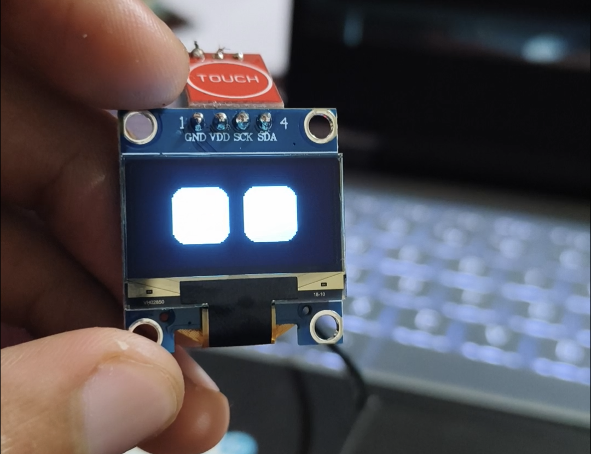

# Robot Eyes Project

  
  

A fun Arduino project featuring a robot with emotional expressions and interactive touch logic. This project uses an OLED display to bring a robot face to life with various moods and animations.

## Features
- **Emotions & Moods**: The robot can express various feelings like HAPPY, ANGRY, TIRED, and even show heart-eyes!
- **Touch Interaction**: Responds to single taps, multi-taps, and long presses.
- **Power Management**: Includes a custom shutdown and turn-on sequence triggered by a 10-second long press.
- **Idle Animations**: The robot looks around, blinks, and gets curious when left alone.
- **Sound Effects**: Integrated buzzer for R2D2-style chirps, screams, and sad tones.

## Hardware Used
- Arduino Nano
- SSD1306 OLED Display (128x64)
- Capacitive Touch Sensor
- Passive Buzzer

## Library Credit
This project relies heavily on the excellent **RoboEyes** library by **Flux Garage**. You can find it here:
[https://github.com/FluxGarage/RoboEyes.git](https://github.com/FluxGarage/RoboEyes.git)

Big thanks to Flux Garage for making robot eyes so easy to implement!

## How to Use
1. Install the `Adafruit_SSD1306` and `FluxGarage_RoboEyes` libraries in your Arduino IDE.
2. Connect your hardware according to the pin definitions:
    - **SCL**: A5
    - **SDA**: A4
    - **Buzzer**: Pin D6 & D7 (low)
    - **Sensor**: A5
3. Upload the code and start interacting with your robot!

## Features added by me
 I implemented a comprehensive set of features to give the robot a dynamic personality and advanced interactivity. The system begins with a custom startup screen that tracks and displays the total number of boots utilizing a counter stored persistently in EEPROM (`eeprom_ran`). For power management, a software standby mode (`powerStatus`) allows the robot to be woken up via a simple touch and put to sleep with a triple tap. The touch interaction logic reads an analog capacitive sensor on pin A6 with custom debouncing to accurately distinguish between single taps (`triggerShortTouchTask()`), long presses (`triggerLongTouchTask()`), triple taps, and excessive consecutive tapping (`triggerTooManyTapsTask()`). These inputs drive dynamic emotion control, transitioning the robot through various moods (happy, laughing, tired, angry) and eye-flickering animations when agitated. To ensure the robot feels alive when left alone, `handleIdleAnimations()` executes a detailed, time-based timeline of autonomous idle behaviors—including waking up, looking around, sweating, expressing curiosity, and dozing off. Finally, distinct sound behaviors are integrated using a passive buzzer on pin 6, featuring functions for R2D2-style chirps (`playR2D2()`), sad tones (`playSad()`), angry grumbles (`playAngry()`), and frantic screams (`playScream()`), complete with a persistent sound mode toggle saved to EEPROM.

 I also added a random seed generator based on analog noise on ungrounded pins, improved shutdown logic by checking for multiple long touches, refined the idle animation timeline with more realistic timing and behaviors (including sweat, curiosity, and sleep), and added a new angry sound effect (`playAngry()`).

## Interaction Logic
The touch sensor logic supports multi-tap detection within a set time window (`TAP_GAP_TIME`), enabling distinct behaviors based on the number of taps:

- **Single Tap**: Trigger plays an R2D2 sound effect, and updates the robot's expression. Depending on its previous state, it can wake up from sleep looking angry, transition from happy to laughing, or switch to a happy mood with a friendly blink.

- **Triple Tap**: Activates sleep mode. Plays a downward sad tone, displays `"sleeping.."` on the OLED screen, and gracefully puts the robot into software standby.

- **Too Many Taps (4+ Taps)**: Triggers `triggerTooManyTapsTask()`. Agitates the robot, setting its mood to ANGRY. Repeatedly tapping too many times causes it to look confused, alternate between growling sounds with vertical eye flickering and sharp ticks with horizontal flickering, and eventually unleash a frantic glitchy scream if pushed too far.

---

**Note**: I'm just a student experimenting and learning, so parts of this implementation might be a bit messy, janky, or downright stupid. But hey, it works and brings the robot to life! Suggestions, laughs, and improvements are always welcome. :)-jimbru
